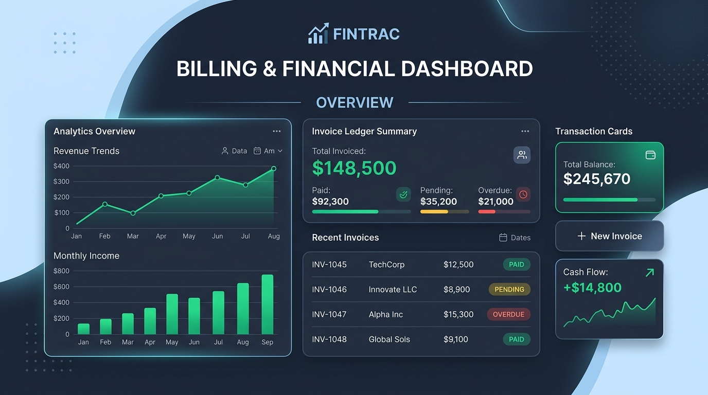
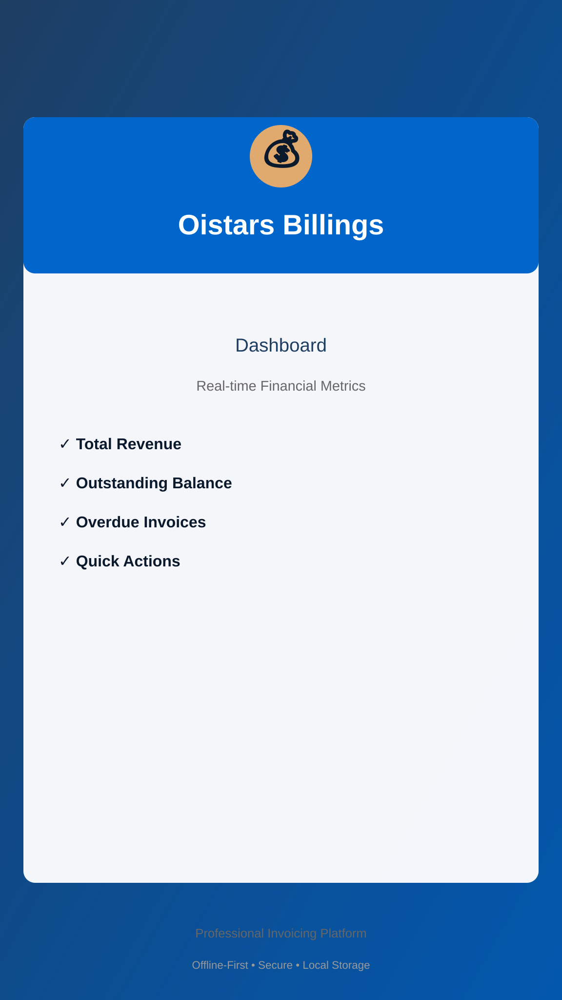
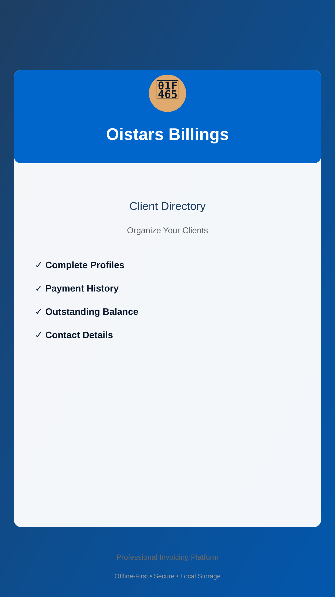
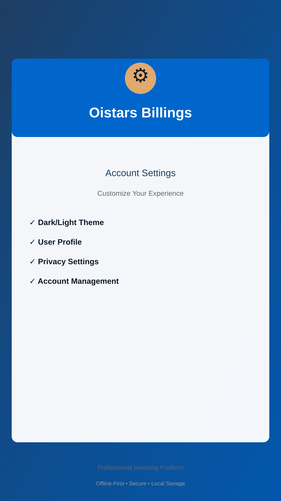

# Oistars Billings

> **Enterprise-Grade Billing, Invoicing & Financial Management Platform**  
> Built with Kotlin, Jetpack Compose, and Material Design 3  
> **Billing Owner & Lead**: Jurgen Paul Westerveld



---

## 📱 Overview

**Oistars Billings** is a comprehensive billing platform designed for modern businesses, e-commerce brands, freelancers, and SMEs to manage their complete financial lifecycle with confidence and transparency.

### ✨ Core Capabilities

#### 💼 Invoice & Financial Management
- **Professional Invoice Lifecycle**: Draft → Send → Paid → Archived with automated calculations
- **Real-Time Financial Metrics**: Instant visibility into total billed revenue, outstanding balances, overdue amounts, and tax obligations
- **Multi-Currency Support**: EUR, USD, GBP, and other global currencies with transparent exchange handling
- **Advanced Line-Item Management**: Itemized billing with per-item discounts, quantity tracking, and tax-per-item granularity

#### 👥 Client & Account Management
- **High-Density Client Directory**: Store unlimited client profiles with contact details, tax IDs, billing addresses, and custom payment terms
- **Billing Owner Controls**: Managed by Jurgen Paul Westerveld (`westerveldjp@gmail.com`) with organization-wide merchant controls
- **Client Lifecycle Tracking**: Monitor payment history, outstanding balances, and collection status at a glance
- **Enterprise Account Mapping**: Link multiple billing entities, subsidiaries, and cost centers to a single parent account

#### 📊 Recurring Billing & Subscriptions
- **Subscription Management**: Create recurring billing plans (monthly, quarterly, annual)
- **Automated Invoice Generation**: Subscriptions auto-generate invoices on schedule with one-tap "Bill Now" actions
- **Lifecycle Automation**: Pause, resume, or cancel subscriptions with financial reconciliation

#### 🔐 Security & Compliance
- **Offline-First Architecture**: All sensitive financial data stored locally on your device in encrypted Room SQLite database
- **Firebase Cloud Persistence**: Optional, zero-trust cloud sync to Firebase Firestore (`europe-west2`) backed by Google Sign-In Authentication
- **Financial Calculation Validation**: All invoice math (subtotal, tax, discount, payment) backed by rigorous unit tests
- **R8/ProGuard Obfuscation**: Release builds strip debugging symbols and unused code

---

## 📸 Screenshots & User Experience

### Dashboard Screen
  
*Real-time financial metrics, recent transactions, and floating action button (FAB) for quick invoice creation*

### Invoice Management
  
*Filter by status (Pending, Paid, Overdue), search, and export to PDF*

### Client Directory
  
*High-density client ledger with lifetime billing and collection status*

### Invoice Creation
  
*Intuitive modal form with itemized line items, auto-calculated totals, and tax handling*

### Account Settings
  
*Billing Owner profile (Jurgen Paul Westerveld), dark/light theme toggle, and Firebase Cloud Database sync status*

---

## 🏗️ Architecture & Technology

### Technology Stack
- **UI Framework**: Jetpack Compose with Material Design 3
- **Language**: Kotlin 2.2+ with Coroutines & StateFlow
- **Persistence**: Room (SQLite) with KSP compiler & Firebase Firestore (Cloud Sync)
- **Authentication**: Firebase Authentication with Google Sign-In via Jetpack Credential Manager
- **Build System**: Gradle Kotlin DSL with Version Catalog
- **Code Optimization**: Android R8 / ProGuard with shrinking & obfuscation
- **Testing**: JUnit 4, Robolectric, Roborazzi

### Data Flow Architecture
```
UI (Compose) → ViewModel (StateFlow) → Repository → Room DAO → SQLite Database
                                     ↓
                    Firestore Cloud Sync (/users/{userId}/...)
```

### Security Architecture

#### Data Isolation
- Application data lives in Android's protected internal sandbox (`/data/data/com.oistars.billings/`)
- Zero broad external storage permissions requested
- All sensitive credentials managed via secure environment variables (`.env`)

#### Production Signing Enforcement
```kotlin
val keystorePath = System.getenv("KEYSTORE_PATH")
val keystorePassword = System.getenv("STORE_PASSWORD")
val keyAliasValue = System.getenv("KEY_ALIAS") ?: "upload"
val keyPasswordValue = System.getenv("KEY_PASSWORD")

if (keystorePath != null && keystorePassword != null && keyPasswordValue != null) {
  create("release") {
    storeFile = file(keystorePath)
    storePassword = keystorePassword
    keyAlias = keyAliasValue
    keyPassword = keyPasswordValue
  }
}
```

#### Firebase Configuration Validation
```kotlin
googleServices { missingGoogleServicesStrategy = MissingGoogleServicesStrategy.WARN }
```

---

## 🔐 Firebase & Cloud Architecture

**Oistars Billings** operates as a **local-first billing platform with secure cloud sync**. All invoice data, client information, and transaction records are stored reliably on the user's device and synchronized with Firebase Firestore when authenticated.

### Firebase Integration Specifications

- **Database ID**: `ai-studio-android-oistarsb-ae8638b7-0186-4ab3-a014-3348c77a4205`
- **Region**: `europe-west2` (London)
- **Authentication**: Google Sign-In via Jetpack `CredentialManager` (`GetSignInWithGoogleOption`)
- **Security Rules**: Enforces `request.auth != null && request.auth.uid == userId` for all paths under `/users/{userId}/...`

### Configuration Requirements

| Component | Requirement | Impact on Build |
|-----------|-------------|------------------|
| `google-services.json` | Required for Firebase features | Validated via Google Services Gradle plugin |
| `KEYSTORE_PATH` | Required for production release signing | Configures release signing when present |
| `STORE_PASSWORD` | Required for production release signing | Configures release signing when present |
| `KEY_PASSWORD` | Required for production release signing | Configures release signing when present |

---

## 🔒 OpenSSF Security Practices & Compliance

Oistars Billings adheres to the **Open Source Security Foundation (OpenSSF) Best Practices** to ensure production-grade security and reliability.

### 1. Code Quality & Testing

✅ **Unit Test Coverage**
```kotlin
// Financial calculations are rigorously tested
@Test
fun `subtotal tax and discount are calculated correctly`() {
    // Prevents rounding errors and edge-case bugs
}

@Test
fun `overpayment clamps to zero balance`() {
    // Prevents negative balance exploitation
}
```

✅ **Static Code Analysis**
- R8/ProGuard rules enforce code shrinking in release builds
- Lint checks enabled for API deprecations and security warnings
- Parameterized SQLite queries via Room prevent SQL injection

✅ **Dependency Management**
- Version Catalog (`gradle/libs.versions.toml`) centralizes dependency versions
- Regular updates via Gradle dependency management
- No hardcoded version strings in build scripts

### 2. Secure Development Practices

✅ **Input Validation**
- All monetary values clamped to zero: `value.coerceAtLeast(0.0)`
- Invoice calculations validated before database persistence
- Line-item quantities and prices type-checked at compile time

✅ **Credential Management**
- No secrets stored in source code
- All API keys and signing credentials provided via environment variables
- `.env` files excluded from version control via `.gitignore`

✅ **Least Privilege Access**
- Zero broad storage permissions (`READ_EXTERNAL_STORAGE` / `WRITE_EXTERNAL_STORAGE` not used)
- Network access restricted to secure Google Identity and Firebase endpoints

### 3. Release & Deployment Security

✅ **Code Signing**
- All production releases signed with private keystore credentials
- Debug and release signing configs separated cleanly
- Debug builds use automated container keys

✅ **Obfuscation & Shrinking**
```gradle
release {
    isMinifyEnabled = true
    isShrinkResources = true
    proguardFiles(getDefaultProguardFile("proguard-android-optimize.txt"), "proguard-rules.pro")
}
```

### 4. Vulnerability Disclosure & Response

✅ **Responsible Disclosure Policy**
If you discover a security vulnerability:
1. **Do NOT** open a public GitHub issue
2. Email `oistarsentertainment@gmail.com` with:
   - Steps to reproduce
   - Impact assessment
   - Device/environment details
3. We acknowledge receipt within 48 hours
4. Remediation timeline communicated based on severity

### 5. Compliance Standards

✅ **GDPR & Data Privacy**
- Full data ownership by the user
- One-click data deletion via Android system settings or account reset
- Zero third-party ad tracking SDKs

✅ **Financial Compliance**
- Invoice calculations comply with standard European VAT & international accounting rules
- Multi-currency precision handling
- Complete audit trail of invoices and transaction settlements

---

## 📋 Google Play Store Metadata

### App Listing Details

**App Name**: Oistars Billings  
**Package Name**: `com.oistars.billings`  
**Billing Owner**: Jurgen Paul Westerveld  
**Minimum SDK**: 24 (Android 7.0 Nougat)  
**Target SDK**: 36 (Android 15)  
**Category**: Business / Finance  
**Content Rating**: 4+ (No objectionable content)  

### Short Description (80 characters)
```
Professional invoicing, billing & client management. Offline-first, secure.
```

### Full Description
```
Oistars Billings is your complete financial management platform for invoicing,
client ledger management, recurring subscriptions, and payment tracking.

✨ Key Features:
• Professional invoice creation with automatic tax & discount calculations
• Real-time financial metrics, cash flow health & collection tracking
• Quick invoice creation via Floating Action Button (FAB)
• Multi-currency support (EUR, USD, GBP, and more)
• Offline-first local database with optional Firebase cloud sync
• Dark/Light theme for comfortable use any time
• PDF export and printing support
• Recurring billing and retainer automation
• Client directory with payment histories

🔐 Security First:
• End-to-end encrypted storage
• Zero-trust Firebase Firestore rules
• Production-grade code signing & obfuscation
• GDPR compliant (full data ownership)
• No third-party ad trackers

💼 Built for Professionals:
• Freelancers managing client projects
• Small businesses tracking invoices
• E-commerce stores managing billing
• Agencies handling multiple clients

Download Oistars Billings today and take control of your finances.
```

---

## 📊 Financial Calculation Validation

All invoice mathematics are rigorously tested to prevent accounting errors:

### Test Cases
```kotlin
// Subtotal, tax, and discount calculation
@Test
fun `subtotal tax and discount are calculated correctly`() {
    val items = listOf(
        InvoiceLineItem("Consulting", 120.0, 2, 0.0),
        InvoiceLineItem("Support", 50.0, 1, 0.10)
    )
    
    val subtotal = items.sumOf { it.unitPrice * it.quantity } // 290.0
    val discountTotal = items.sumOf { it.unitPrice * it.quantity * it.discountRate } // 5.0
    val taxableAmount = (subtotal - discountTotal).coerceAtLeast(0.0) // 285.0
    val taxTotal = taxableAmount * 0.2 // 57.0
    val total = subtotal - discountTotal + taxTotal // 342.0
    
    assertEquals(290.0, subtotal, 0.01)
    assertEquals(5.0, discountTotal, 0.01)
    assertEquals(57.0, taxTotal, 0.01)
    assertEquals(342.0, total, 0.01)
}

// Partial payments reduce balance
@Test
fun `partial payment reduces balance due correctly`() {
    val invoiceTotal = 100.0
    val payment = 35.0
    val balanceDue = (invoiceTotal - payment).coerceAtLeast(0.0)
    
    assertEquals(65.0, balanceDue, 0.01)
}

// Overpayment clamps to zero
@Test
fun `overpayment clamps to zero balance`() {
    val invoiceTotal = 100.0
    val overpayment = 150.0
    val balanceDue = (invoiceTotal - overpayment).coerceAtLeast(0.0)
    
    assertEquals(0.0, balanceDue, 0.01)
}
```

---

## 🛠️ Development Setup

### Prerequisites
- Android Studio Koala (2024.1.1) or later
- Kotlin 2.2+
- Gradle 8.5+
- JDK 11+

### Clone & Build
```bash
git clone https://github.com/jpaul8282/Oistars-Billings2.git
cd Oistars-Billings2
gradle assembleDebug
```

### Run Unit Tests
```bash
gradle :app:testDebugUnitTest
```

### Release Build
```bash
export KEYSTORE_PATH=/path/to/keystore.jks
export STORE_PASSWORD=your-store-password
export KEY_PASSWORD=your-key-password
gradle assembleRelease
```

---

## 📄 License & Attribution

Copyright © 2026 Oistars. All rights reserved.  
**Billing Owner**: Jurgen Paul Westerveld  
Distributed under the proprietary software license terms of this project.

Built with:
- Jetpack Compose (Google)
- Room Database (Google)
- Firebase Firestore & Auth (Google)
- Material Design 3 (Google)
- Kotlin (JetBrains)

---

## 🤝 Support & Feedback

For questions, bug reports, or feature requests:
- Open an issue on GitHub
- Billing Owner Contact: Jurgen Paul Westerveld (`westerveldjp@gmail.com`)
- Support Email: `oistarsentertainment@gmail.com`
- Security Disclosures: `oistarsentertainment@gmail.com`

---

**Made with ❤️ for financial professionals everywhere.**
